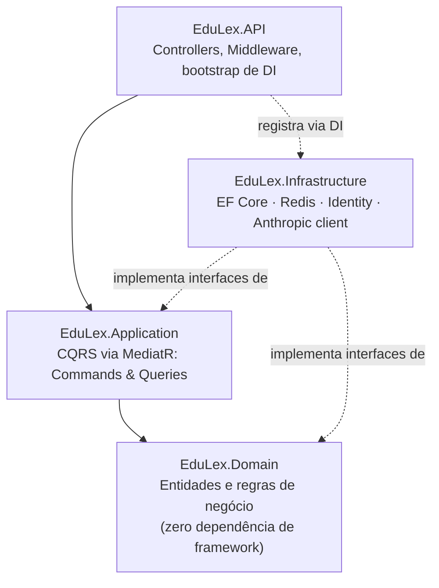
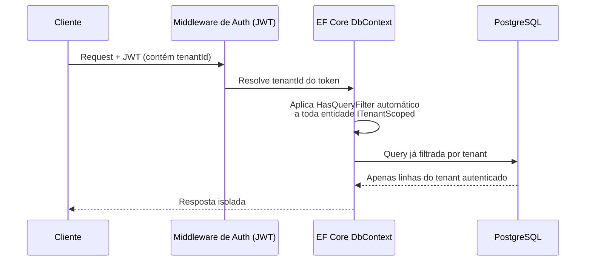
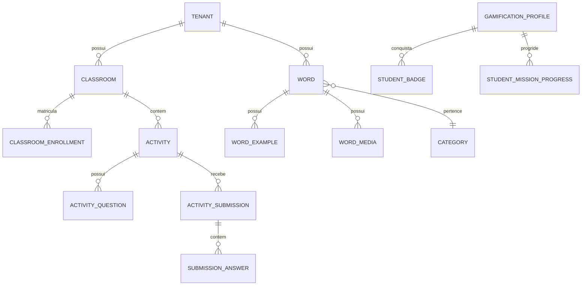
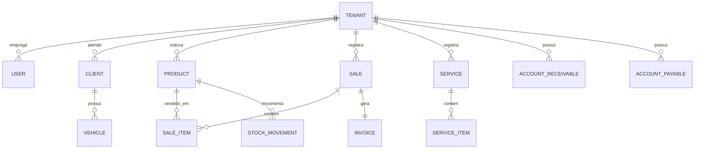
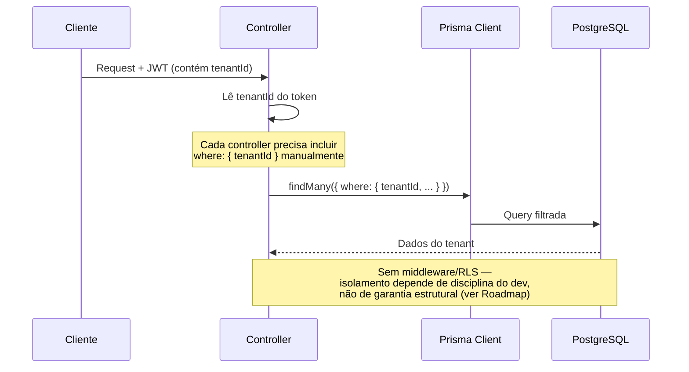
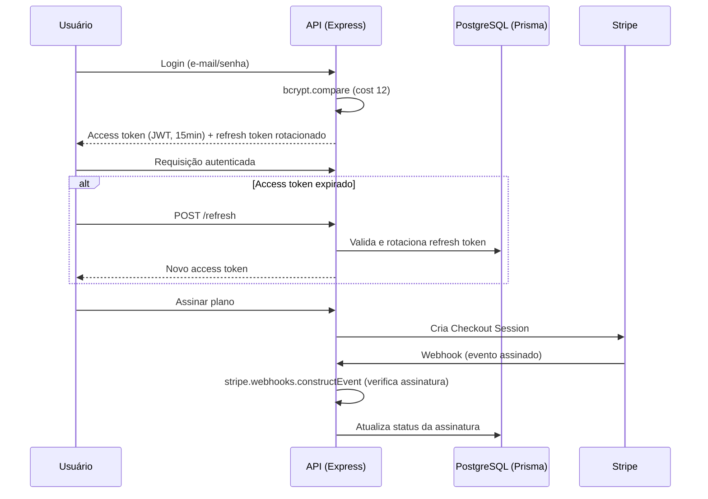
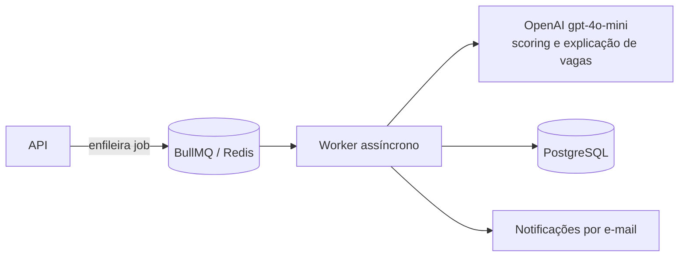
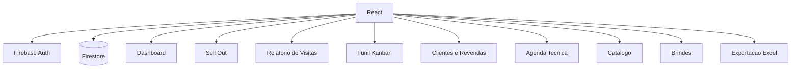

# Full-Stack Engineer

### Não construo protótipo de portfólio. Construo o que aguenta cliente pagando.

🇧🇷 RS, Brasil · Founder @ Oliveira Systems · Aberto a oportunidades Full-Stack/Backend remotas

 

**4 sistemas auditados linha a linha neste README** · **90+ endpoints combinados** · **multi-tenancy real, billing com webhook validado, testes de integração com Testcontainers**
*(sem enfeite de marketing — cada claim abaixo aponta pro código que a sustenta)*

---

## Sumário

- [Sobre mim](#sobre-mim)
- [Projetos: visão rápida](#projetos-visão-rápida)
- [Como eu penso engenharia](#como-eu-penso-engenharia)
- [Stack](#stack)
- [Projetos em destaque](#projetos-em-destaque)
  - [EduLex](#1-edulex)
  - [TireMax ERP](#2-tiremax-erp)
  - [Oliveira Apply AI](#3-oliveira-apply-ai)
  - [CRM Comercial B2B](#4-crm-comercial-b2b)
- [Outros destaques](#outros-destaques)
- [Matriz de engenharia](#matriz-de-engenharia)
- [Roadmap](#roadmap)
- [Outros projetos](#outros-projetos)
- [FAQ](#faq)
- [Licença dos repositórios](#licença-dos-repositórios)
- [Contato](#contato)

---

## Sobre mim

Full-stack engineer que projeta e mantém sistemas sozinho, do schema do banco ao webhook de pagamento. Bagagem anterior na indústria metalúrgica — hoje aplicada em como decomponho problemas técnicos e priorizo entregas sob prazo.

Já entreguei, entre outros:
- Um **ERP multi-tenant** para o setor automotivo, em produção (`TireMax`)
- Uma **plataforma educacional** com Clean Architecture e testes de integração reais (`EduLex`)
- Um **SaaS de automação de busca de emprego** com billing real via Stripe (`Oliveira Apply AI`)
- Um **CRM comercial sob medida** para cliente real do setor de distribuição B2B

Trabalho principalmente com **Node.js, TypeScript, React, Next.js, .NET e Java/Spring Boot**.

> **Nota de transparência:** as seções abaixo descrevem o estado real de cada projeto — incluindo o que ainda falta. Prefiro te mostrar isso agora do que você descobrir sozinho lendo o código. A seção [Matriz de engenharia](#matriz-de-engenharia) resume tudo numa tabela.

---

## Projetos: visão rápida

| Projeto | Status | Stack principal | Prova real |
|---|---|---|---|
| [EduLex](#1-edulex) | 🎓 Portfólio técnico | .NET 8 · CQRS/MediatR · PostgreSQL | 28 testes, incl. integração com Testcontainers |
| [TireMax ERP](#2-tiremax-erp) | 🟢 Implantado | React · Node.js · Prisma | [Dashboard ao vivo](https://tiremax.vercel.app) |
| [Oliveira Apply AI](#3-oliveira-apply-ai) | 🟡 Funcional | Next.js · Stripe · OpenAI | Webhook de pagamento com verificação de assinatura |
| [CRM Comercial B2B](#4-crm-comercial-b2b) | 💼 Cliente real | React · Firebase | Em uso operacional (repo privado) |

---

## Como eu penso engenharia

- **Domínio isolado de framework.** Se a regra de negócio depende de um ORM ou de um decorator de infraestrutura para existir, ela não está no lugar certo.
- **Multi-tenancy é garantia estrutural, não convenção.** Isolamento por tenant deveria ser impossível de esquecer — via query filter automático, middleware ou RLS — não algo que depende de um dev lembrar de escrever `WHERE tenantId = ?` em todo endpoint novo. Tenho um exemplo de cada abordagem nos projetos abaixo, e sei qual é a certa.
- **Teste de integração > mock de infraestrutura.** Prefiro subir um Postgres/Redis real via Testcontainers a confiar que meu mock se comporta como o serviço real.
- **Webhook sem verificação de assinatura não é integração, é confiança cega.** Todo webhook de pagamento que escrevo valida a assinatura antes de processar o evento.

---

## Stack

**Linguagens & Runtime**

**Backend & APIs**

**Frontend**

**Dados & Infraestrutura**

---

## Projetos em destaque

### 1. EduLex

**Plataforma educacional multi-tenant.** Plataforma de gestão de vocabulário/idiomas para escolas: dicionário multilíngue, turmas e matrículas, atividades com submissão e correção, gamificação (níveis, badges, missões) e geração de conteúdo assistida por IA (Anthropic — histórias, explicações de palavras, sugestão de exercícios).

Este é o projeto com a **arquitetura mais rigorosa** do portfólio: 4 camadas reais (Domain sem nenhuma dependência de framework), CQRS via MediatR, e isolamento de tenant **automático** — não depende de nenhum desenvolvedor lembrar de filtrar por tenant em cada query.

`.NET 8` `EF Core` `PostgreSQL` `Redis` `MediatR` `Anthropic API` `Testcontainers`

**Estado real:** 45 endpoints em 8 controllers, **124 testes** (`[Fact]`/`[Theory]`, contagem exata no código) cobrindo unit (Domain/Application) e integração com Testcontainers reais de Postgres e Redis — não mock de infraestrutura — em 4 migrations incrementais bem versionadas. É o projeto tecnicamente mais maduro do portfólio. Falta: CI configurado e validação com usuários reais em produção. README próprio reescrito com hero, diagramas Mermaid e LICENSE (MIT) adicionada — [ver repositório](https://github.com/RobersonCodes/SaaS-Educativo).

<strong>📐 Ver arquitetura técnica</strong> (camadas, isolamento de tenant, modelo de dados)

**Arquitetura em camadas:**

**Isolamento de tenant — automático via EF Core:**

**Modelo de dados (simplificado):**

---

### 2. TireMax ERP

**Gestão para borracharias.** ERP para borracharias e centros automotivos: clientes e veículos, ordens de serviço, estoque de pneus, PDV, financeiro (contas a pagar/receber) e identidade visual configurável por tenant (logo e cor). Implantado e acessível publicamente.

`React` `Node.js` `Prisma` `PostgreSQL` `Vite` `Capacitor` (builds Android/iOS a partir da mesma base React)

**Estado real:** modelagem de domínio de ERP genuinamente completa para o nicho — 15 models Prisma com constraints únicas bem pensadas por tenant (e-mail, placa, código de produto, número de venda). Isolamento por tenant funciona hoje, mas por convenção manual em cada controller, não por enforcement estrutural — está no roadmap migrar isso. Faltam também testes automatizados, CI e rate limiting. A automação via WhatsApp mencionada em versões anteriores deste README **não existe no código** — foi removida desta descrição.

**Achei e corrigi um bug de verdade aqui, não só de texto**: o `docker-compose.yml` subia um container **MySQL** enquanto `schema.prisma`/`.env.example` sempre foram **PostgreSQL** — `docker-compose up` derrubava a API na primeira query. Corrigido. Removidas também 5 variáveis mortas de uma automação WhatsApp que nunca existiu no código, um `database.sql` obsoleto (dialeto MySQL, sem nada referenciando ele), e adicionada a `LICENSE` (MIT) que o README já alegava sem o arquivo existir.

🔗 [tiremax.vercel.app](https://tiremax.vercel.app)

<strong>📐 Ver arquitetura técnica</strong> (modelo de dados, isolamento de tenant)

**Modelo de dados:**

**Isolamento de tenant — manual, ponto de atenção conhecido:**

---

### 3. Oliveira Apply AI

**Automação de busca de emprego.** SaaS que centraliza e pontua vagas de múltiplas plataformas para o usuário, com dashboard de métricas, notificações e cobrança via Stripe.

`Next.js` `Node.js` `Express` `Prisma` `PostgreSQL` `BullMQ` `Redis` `Stripe` `OpenAI`

**Estado real:** o webhook do Stripe valida assinatura de verdade (`constructEvent`, não é só um botão de checkout) e o refresh token rotation é uma implementação sólida — 19 controllers, 20 arquivos de rota e 15 models Prisma no total. O "score de vaga" é um modelo de pontuação linear/logístico personalizado por usuário combinado com uma chamada de LLM para explicação — não é uma rede neural (o módulo se chama "neural" no código, a técnica não é), e prefiro chamar aqui pelo nome certo. Falta: testes automatizados e CI (zero hoje — maior gap deste projeto). Dois módulos de automação (`shadowApply`, geração de perfil sintético para testar vagas; `conexaoCirurgica`, engajamento agendado no LinkedIn antes da candidatura, incluindo lógica de evasão de detecção de bot) existem no código mas foram deixados fora desta descrição — e do README do próprio repositório — até revisão de conformidade com os termos de uso do LinkedIn.

<strong>📐 Ver arquitetura técnica</strong> (auth, billing, fila assíncrona)

**Autenticação e billing:**

**Fila assíncrona de monitoramento de vagas:**

---

### 4. CRM Comercial B2B

**Projeto para cliente real.** CRM sob medida para uma distribuidora do setor de ferramentas profissionais: dashboard, relatório de visitas comerciais (35 campos, espelhando uma planilha real de campo), funil de vendas em Kanban, cadastro de clientes/revendas, agenda técnica, catálogo de produtos e exportação para Excel.

`React` `Firebase Auth` `Firestore`

**Estado real:** projeto freelance genuíno, entregue e em uso por um cliente real, com dados de campo migrados de planilha (centenas de contas de revenda, dezenas de produtos) — prova de que sei levar sistema do zero até uso operacional fora de mim mesmo como usuário. Faltam testes automatizados. O repositório é **privado** porque contém dados comerciais de terceiros. Este projeto tinha sido descrito antes como "CRM Enterprise SaaS .NET com CQRS" — essa descrição nunca correspondeu ao código; foi corrigida aqui.

O repositório também tem arquivos órfãos de outro projeto (`src/server.ts`, `src/controllers/`, parte de `src/routes/`, `src/middlewares/`) — um backend Express/Prisma/Stripe sem nenhuma dependência declarada no `package.json` deste projeto (CRA puro com Firebase) e sem uso em nenhuma tela real. Provavelmente foi parar aqui numa cópia de pasta errada em algum commit anterior. Ainda não limpei, mas está anotado no README do próprio repositório.

📦 Repositório privado — disponível sob solicitação, sem dados de cliente.

<strong>📐 Ver arquitetura técnica</strong> (módulos)

---

## Outros destaques

**🛡️ SAFEHER — PWA anti-feminicídio (SBC 2026).** Plataforma acadêmica de monitoramento e alerta: geolocalização com geofencing (Haversine), alertas via Socket.IO, interface disfarçada de calculadora, assistente de IA para crise. `React` `Node.js` `Socket.IO` `PostgreSQL` `Anthropic API`

**🛒 Minha Loja — e-commerce full-stack.** Checkout em 3 etapas com Stripe (Checkout hospedado + webhook HMAC), avaliação de produto validada no backend (só quem comprou avalia), 28 testes automatizados (Vitest). `Node.js` `TypeScript` `Prisma` `MySQL` `React` `Stripe`

📦 [Repositório](https://github.com/RobersonCodes/minha-loja) *(privado — solicite acesso)*

*(Essas duas descrições foram herdadas do README anterior e não passaram pela mesma auditoria de código linha a linha que os 4 projetos acima passaram.)*

---

## Matriz de engenharia

O estado real de cada projeto, lado a lado:

| Projeto | Arquitetura | Multi-tenancy | Testes | CI | Auth |
|---|---|---|---|---|---|
| EduLex | Clean Architecture (4 camadas) + CQRS/MediatR | ✅ Automático (EF Core query filter) | ✅ 124 testes (unit + integração/Testcontainers) | ❌ | JWT + refresh (Redis) |
| TireMax ERP | MVC pragmático (routes → controllers → Prisma) | ⚠️ Manual (por convenção) | ❌ | ❌ | JWT (7 dias, sem refresh) |
| Oliveira Apply AI | MVC + services isolados | N/A (single-tenant) | ❌ | ❌ | JWT (15min) + refresh rotacionado |
| CRM Comercial B2B | CRA + Firebase (BaaS) | N/A (cliente único) | ❌ | ❌ | Firebase Auth |

Esta tabela existe de propósito: prefiro que você a veja aqui do que descubra sozinho.

---

## Roadmap

- [ ] CI (lint + test) para EduLex, TireMax, Oliveira Apply AI e CRM Comercial
- [ ] Suíte de testes para TireMax, Oliveira Apply AI e CRM Comercial
- [ ] Migrar isolamento de tenant do TireMax de manual para estrutural (Prisma middleware/extension ou RLS no Postgres)
- [ ] Helmet + rate limiting no backend do TireMax
- [ ] Revisão de conformidade dos módulos de automação do Oliveira Apply AI (`shadowApply`, `conexaoCirurgica`) antes de qualquer divulgação pública mais detalhada
- [ ] Remover os arquivos órfãos de outro projeto do repositório do CRM Comercial B2B (`src/server.ts`, `src/controllers/`, parte de `src/routes/`, `src/middlewares/`)
- [ ] Changelog e releases versionadas nos projetos ativos
- [x] Corrigir `docker-compose.yml` do TireMax (subia MySQL, schema é Postgres) e adicionar `LICENSE` em EduLex, TireMax e Oliveira Apply AI

---

## Outros projetos

| Projeto | O que é | Stack |
|---|---|---|
| Guardian Recovery Platform | Monitoramento enterprise com dashboard e disaster recovery | `Java 17` `Spring Boot 3.5` `Spring Security/JWT` `MySQL` `Flyway` |
| task-manager-api | API REST de tarefas — **com testes e CI reais** | `TypeScript` `Express` `Prisma` `Postgres` `Vitest` `Docker` `GitHub Actions` |
| Ai-Funnel-Pro | Landing page estilo SaaS com animações 3D | `Three.js` `CSS` `HTML` `JavaScript` |
| Modelo de Site para Barbearia | Site institucional sem framework | `HTML` `CSS` `JavaScript` |
| Sistema de Saúde Municipal | Gestão de saúde pública (inspirado no SUS) + chatbot IA | `Java` `Spring Boot` `MySQL` `OpenAI API` |
| vialivre-ai | Previsão de atraso e rota urbana com clima em tempo real | `Node.js` `Express` `Leaflet` `OSRM` `Open-Meteo` |
| Projeto Gerenciador de Tarefas | App desktop de tarefas | `Java Swing` `MySQL` `BCrypt` |
| checkers-game | Damas com IA (Minimax + poda alfa-beta) | `TypeScript` `Vite` |
| game-jogo-da-velha | Jogo da velha com IA | `Java Swing` `Minimax` |
| batalha-rpg-panel | RPG por turnos | `Java Swing` |
| Caffè Milano e Negócios | Site institucional premium | `Next.js 15` |
| LuminaVet | Landing page veterinária | `Next.js` `React` |
| Flight Simulator | Renderização 3D geoespacial | `JavaScript` `CesiumJS` |

*(Verificado a partir do README de cada repositório público — não passaram pela mesma auditoria de código linha a linha dos 4 flagships.)* Vale registrar: o `task-manager-api`, um projeto menor, tem CI e suíte de testes que EduLex, TireMax, Oliveira Apply AI e o CRM Comercial ainda não têm — está no roadmap fechar essa inconsistência.

---

## FAQ

**Por que alguns projetos não têm testes ainda?**
Porque não têm, de verdade — e prefiro dizer isso a fingir que têm. Está no roadmap.

**Você trabalha sozinho nesses projetos?**
Sim, nos de portfólio pessoal. O CRM Comercial foi entregue para um cliente real como freelancer.

**Por que o TireMax não tem mais a automação via WhatsApp que estava aqui antes?**
Porque, auditando o próprio código, ela não existe. Prefiro corrigir a manter uma alegação que não se sustenta se alguém abrir o repositório.

**Está disponível para trabalho remoto?**
Sim — Full-Stack ou Backend, remoto ou presencial no RS.

---

## Licença dos repositórios

Este repositório é o meu perfil do GitHub, não um produto único — cada projeto linkado acima tem seu próprio repositório e licença (quando pública). Não existe uma licença única que cubra todos.

---

## Contato

<strong>📊 Contribuições no GitHub</strong>

 

<picture>
  <source media="(prefers-color-scheme: dark)" srcset="https://raw.githubusercontent.com/RobersonCodes/RobersonCodes/output/github-snake-dark.svg" />
  <source media="(prefers-color-scheme: light)" srcset="https://raw.githubusercontent.com/RobersonCodes/RobersonCodes/output/github-snake.svg" />
  
</picture>

