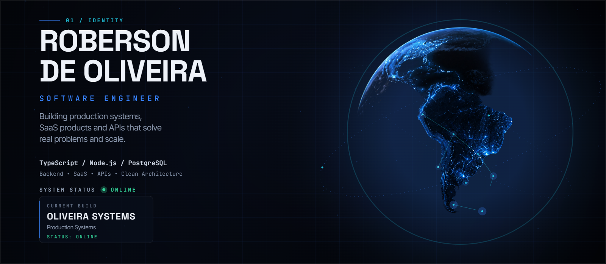
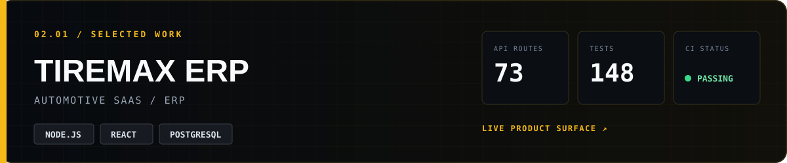
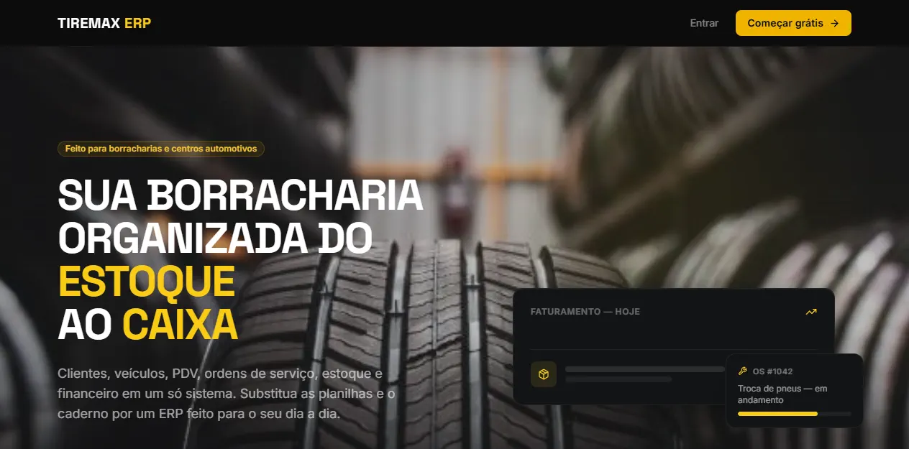
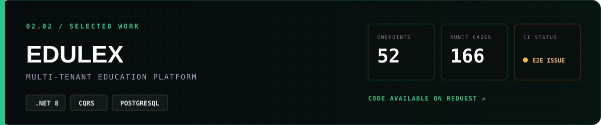
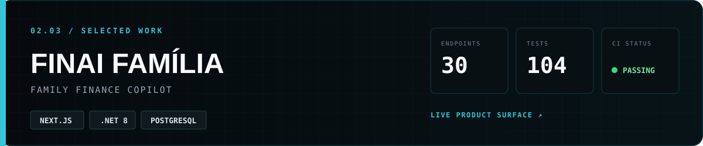
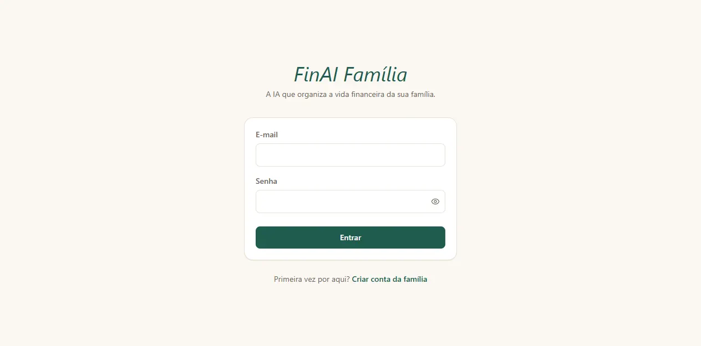
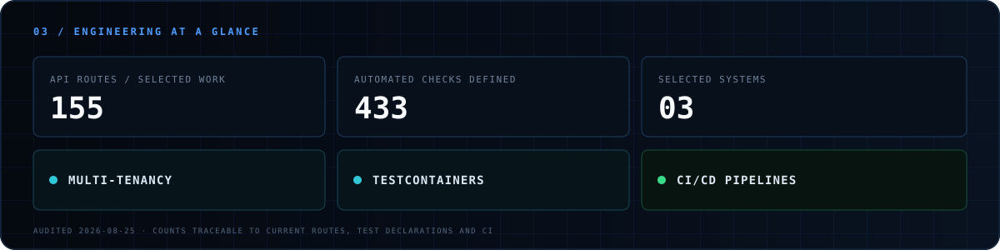

<a href="./assets/hero/github-hero-animated-desktop.webm">
  <picture>
    <source media="(max-width: 600px)" srcset="./assets/hero/github-hero-mobile.webp">
    <source media="(prefers-color-scheme: dark)" srcset="./assets/hero/github-hero-dark.webp">
    <source media="(prefers-color-scheme: light)" srcset="./assets/hero/github-hero-poster-desktop.png">
    
  </picture>
</a>

  <a href="./assets/hero/github-hero-animated-desktop.webm">▶ View animated desktop hero</a>

  <a href="#selected-work">Selected work</a>&nbsp;&nbsp;/&nbsp;&nbsp;
  <a href="#engineering">Engineering</a>&nbsp;&nbsp;/&nbsp;&nbsp;
  <a href="#stack">Stack</a>&nbsp;&nbsp;/&nbsp;&nbsp;
  <a href="#about">About</a>&nbsp;&nbsp;/&nbsp;&nbsp;
  <a href="#github">GitHub</a>&nbsp;&nbsp;/&nbsp;&nbsp;
  <a href="#connect">Connect</a>

  Full-Stack / Backend Engineering · São Leopoldo, RS, Brazil 
  <a href="https://oliveirasystems.dev">Portfolio</a> ·
  <a href="https://www.linkedin.com/in/roberson-de-oliveira-tecnologia">LinkedIn</a> ·
  <a href="mailto:roberson_sl@hotmail.com">Email</a>

## 02 / SELECTED WORK

Three projects carry the most weight here. Each count below was recalculated
from the current repository, test declarations and CI state on **2026-08-25**.

### 01 — TireMax ERP

Automotive SaaS/ERP for customers, vehicles, inventory, point of sale, service
orders, finance and fiscal workflows. Tenant isolation is enforced in the data
layer with `AsyncLocalStorage` and a Prisma Client extension, backed by explicit
controller scoping.

`Node.js` · `Express` · `React` · `Prisma` · `PostgreSQL` · `Jest` · `GitHub Actions`

[Repository](https://github.com/RobersonCodes/Tiremax) ·
[Live product surface](https://tiremax.vercel.app) ·
[Technical archive](./docs/PORTFOLIO-TECHNICAL.md)

---

### 02 — EduLex

Multi-tenant education platform for schools, teachers, students and guardians.
The backend separates Domain, Application, Infrastructure and API; CQRS runs
through MediatR, and EF Core query filters enforce tenant scoping automatically.

`.NET 8` · `CQRS / MediatR` · `PostgreSQL` · `Redis` · `Next.js` · `Flutter` · `Testcontainers`

The private repository currently defines **166 xUnit cases** plus **15 Playwright
specs**. Backend, frontend and mobile CI jobs pass; the latest E2E job needs
repair.

[Live product surface](https://edulex.vercel.app) ·
[Technical archive](./docs/PORTFOLIO-TECHNICAL.md) ·
Private code available for a technical review on request

---

### 03 — FinAI Família

Family finance copilot running on Railway. A Next.js BFF keeps tokens in
HTTP-only cookies and proxies authenticated requests to the ASP.NET Core API;
the assistant streams answers grounded in the family's financial data.

`Next.js 16` · `.NET 8` · `EF Core` · `PostgreSQL` · `Anthropic SDK` · `Vitest` · `Playwright`

Current verification: **30 endpoints**, **104 automated tests** across backend,
frontend and E2E, with all three CI jobs passing.

[Live product surface](https://frontend-production-047c.up.railway.app) ·
[Technical archive](./docs/PORTFOLIO-TECHNICAL.md) ·
Private code available for a technical review on request

  <a href="https://github.com/RobersonCodes?tab=repositories">
    <strong>VIEW ALL PROJECTS →</strong>
  </a>

## 03 / ENGINEERING AT A GLANCE

The aggregate is traceable: `73 + 52 + 30 = 155` routes/endpoints;
`148 + 181 + 104 = 433` automated checks defined. It does **not** claim 433
current passes—the EduLex E2E job is explicitly reported above.
[See the audit trail.](./docs/README-AUDIT.md)

What I optimize for:

- Business rules that stay separate from frameworks and transport details.
- Tenant isolation enforced structurally, not left to developer memory.
- Integration tests against real infrastructure when database behavior matters.
- Delivery pipelines that make build and test state visible.

## 04 / STACK

<table>
  <tr>
    <td width="16%"><strong>CORE</strong></td>
    <td>
      
      <strong>TypeScript</strong>&nbsp;&nbsp;
      
      <strong>Node.js</strong>&nbsp;&nbsp;
      
      <strong>PostgreSQL</strong>
    </td>
  </tr>
  <tr>
    <td><strong>BACKEND</strong></td>
    <td>
      
      Node.js&nbsp;&nbsp;
      
      .NET&nbsp;&nbsp;
      
      Java / Spring Boot
    </td>
  </tr>
  <tr>
    <td><strong>WEB</strong></td>
    <td>
      
      React&nbsp;&nbsp;
      
      Next.js
    </td>
  </tr>
  <tr>
    <td><strong>DATA</strong></td>
    <td>
      
      PostgreSQL&nbsp;&nbsp;
      
      Redis&nbsp;&nbsp;
      
      MySQL
    </td>
  </tr>
  <tr>
    <td><strong>INFRA</strong></td>
    <td>
      
      Docker&nbsp;&nbsp;
      
      GitHub Actions&nbsp;&nbsp;
      
      Linux
    </td>
  </tr>
</table>

## 05 / ABOUT

I build systems beyond the prototype.

My work spans backend engineering, SaaS, APIs, relational databases, automated
testing and delivery pipelines. I care about clean architecture, maintainability
and software that survives beyond the demo.

My earlier experience in the metalworking industry still shapes how I decompose
technical problems, work within constraints and prioritize delivery.

[Read the preserved technical portfolio →](./docs/PORTFOLIO-TECHNICAL.md)

## 06 / GITHUB

### Recent public repositories

This compact list updates daily through GitHub Actions. Flagship projects remain
curated manually so a new experiment never replaces proven work automatically.

<!-- AUTO-REPOS:START -->
- [**StartupEmpire**](https://github.com/RobersonCodes/StartupEmpire) —
  Startup Empire — Jogo mobile de estratégia, Tycoon e Idle desenvolvid… · `C#` · created Aug 2026
- [**Oliveira-DevCloud**](https://github.com/RobersonCodes/Oliveira-DevCloud) —
  Monorepo TypeScript para uma plataforma de desenvolvimento cloud: Fas… · `TypeScript` · created Aug 2026
- [**Leonel-Lanches**](https://github.com/RobersonCodes/Leonel-Lanches) —
  Enterprise Food Ordering Platform built with Next.js, Node.js, TypeSc… · `TypeScript` · created Aug 2026
- [**oliveira-systems-api-architecture**](https://github.com/RobersonCodes/oliveira-systems-api-architecture) —
  Architecture decision records for a multi-tenant REST API foundation.… · created Aug 2026
- [**Gest-o-de-Solicita-es-Internas**](https://github.com/RobersonCodes/Gest-o-de-Solicita-es-Internas) —
  ▎ Sistema corporativo multiempresa para abertura, aprovação e atendim… · `TypeScript` · created Aug 2026
<!-- AUTO-REPOS:END -->

[All repositories](https://github.com/RobersonCodes?tab=repositories) ·
[Contribution activity](https://github.com/RobersonCodes)

## 07 / CONNECT

**Let's build reliable software.**

[LinkedIn](https://www.linkedin.com/in/roberson-de-oliveira-tecnologia) ·
[Portfolio](https://oliveirasystems.dev) ·
[GitHub](https://github.com/RobersonCodes) ·
[Email](mailto:roberson_sl@hotmail.com)

São Leopoldo / RS / Brazil 
Open to Full-Stack or Backend opportunities — remote or on-site in RS.

---

  Profile facts audited on 2026-08-25 ·
  [Verification notes](./docs/README-AUDIT.md) ·
  No external stats widget required

